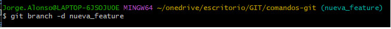

# Comandos-Git

 

- **
git-clone https://github.com/let-io/Comandos-Git** (permite clonar en local un repositorio remoto que hay en github)

- **
git pull** (permite descargar y actualizar en el repositorio local los cambios que ha habido en el repositorio en github)

- **
git checkout + nombre de rama** (permite cambiar a la rama indicada)

- **
git branch + nombre de rama** (permite crear una rama en local)

- **
git push origin + nombre de rama** (permite subir una rama local a github)

 

### Secuencia de comandos para añadir archivo a rama local y subir a rama remota (github)  
 

***1. Se añade un archivo al directorio local*** 
**2. git status** (muestra el archivo en rojo porque no se ha subido) 
**3. git add** (para añadir de forma provisional el nuevo contenido añadido al directorio local) 
**4. git status** (muestra el archivo en verde) 
**5. git commit -m "commit prueba"** (commitear con mensaje) 
***6. muestra mensaje para indicar que se ha agregado el archivo de forma definitiva*** 
**7. git push -u origin + rama local** (agregar un archivo archivo a una rama) 
***8. el archivo se ha subido a la rama remota en github***

    Enumerating objects: 4, done.
    Counting objects: 100% (4/4), done.
    Delta compression using up to 8 threads
    Compressing objects: 100% (2/2), done.
    Writing objects: 100% (3/3), 309 bytes | 309.00 KiB/s, done.
    Total 3 (delta 0), reused 0 (delta 0), pack-reused 0
    To https://github.com/let-io/Comandos-Git
    b000c55..66e7be0  feature_prueba -> feature_prueba
    branch 'feature_prueba' set up to track 'origin/feature_prueba'.
    
**git branch -D + rama en local** (eliminar la rama local indicada) 

**git branch + nombre de la rama** (para crear una rama en local a partir de la rama 'develop') 

**rm -rf + nombre de archivo o directorio** (permite eliminar un archivo o directorio local) 

  

### Comparar dos ramas 

**1. git checkout + nombre de la rama** (cambiar a la rama creada a partir de develop) 
**2. git request-pull + rama develop + url del repositorio** (compara la rama feature con la rama develop)
